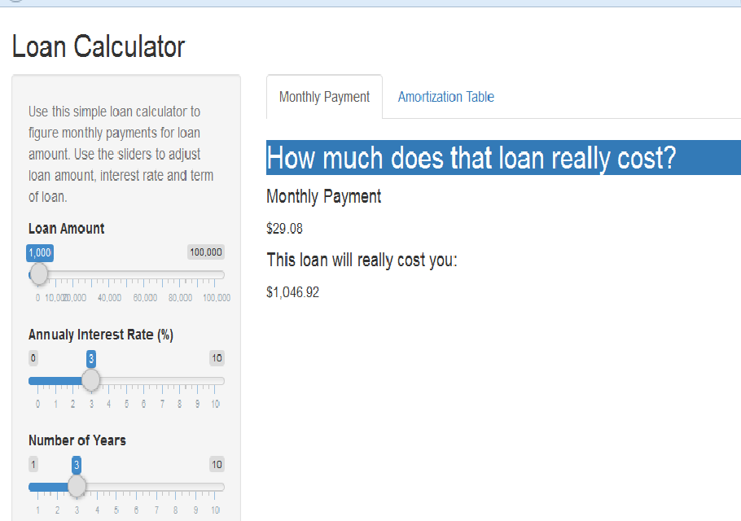

Loan Payment Calculator
========================================================
author: Chandra Prakash
date: 06-21-2015

Loan Payment Calculator Overview
========================================================

* Developed using Shiny and R.  
* Calculates monthly payments required to payoff a loan.
* Calculates amortization table.
* Allows to vary inputs using sliders
  + Loan Amount
  + Interest Rate
  + Term of Loan


Application Demo
========================================================


Monthly Payment Calculation
========================================================

```
  rate   loan term monthlyPayment totalPaid
1    3 $1,000    3         $29.08 $1,046.92
```

Amortization Calculation
========================================================


```
  month interest principal outstanding
1     1    $2.50    $26.58     $973.42
2     2    $2.43    $26.65     $946.77
3     3    $2.37    $26.71     $920.06
4     4    $2.30    $26.78     $893.28
5     5    $2.23    $26.85     $866.43
6     6    $2.17    $26.92     $839.51
```


